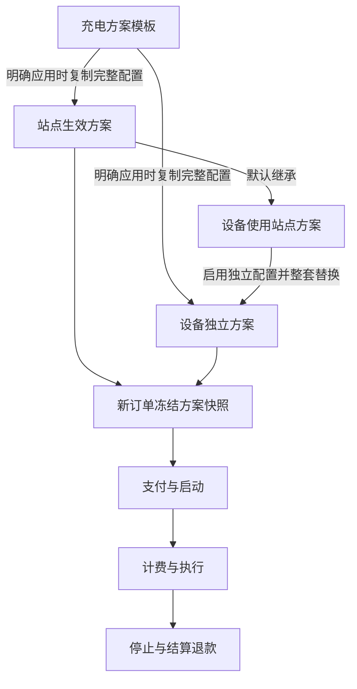

# 充电方案业务重构方案与计算示例

更新日期：2026 年 10 月 1 日。

本文记录本轮已确认的计费、套餐、站点、设备和刷卡业务规则，并用具体数字说明支付、计费、停止与退款。代码改造与验证范围见 [实施说明](charging-scheme-implementation.md)。数据库迁移、真实设备和微信消息投递仍需独立验收，算法测试不能代替这些验证。

系统从未上线，本次重新建立业务模型和测试数据，不迁移旧计费配置、不保留旧业务兼容逻辑。本文不涉及脉冲设备；目标设备 DC589 使用 4G 连接，通过 TCP 通信。

## 1 业务对象与模式

### 1.1 计费与套餐的区别

计费规则决定“充电过程中如何计算消耗”；支付套餐决定“用户先支付多少，以及获得什么”。两者必须在同一个充电方案中配置，不能作为两个互不关联的模板池。

| 对象 | 内容 | 作用 |
| --- | --- | --- |
| 充电方案模板 | 启用模式、费率、支付套餐、配置、用户展示 | 可复用的配置来源 |
| 站点生效方案 | 从模板复制或编辑后独立保存的完整配置 | 站点的新订单使用的方案 |
| 设备独立方案 | 从模板复制或编辑后独立保存的完整配置 | 替代站点方案，整套生效 |
| 订单方案快照 | 下单时的完整配置、套餐及价格 | 决定本订单的执行、计费和退款 |

模板编辑、删除或停用不会修改已经应用的站点与设备方案。已支付但尚未启动的订单也使用冻结快照。

### 1.2 同时支持的模式

| 用户入口 | 执行主体 | 后台算法 | 用户选择 | 支付后执行 |
| --- | --- | --- | --- | --- |
| 金额模式 | 服务端 | 最大功率 | 固定金额套餐，如 1、2、3 元 | 持续计算费用，余额耗尽停止 |
| 金额模式 | 服务端 | 实时功率 | 固定金额套餐 | 持续计算费用，余额耗尽停止 |
| 金额模式 | 服务端 | 电量 | 固定金额套餐 | 按实际电量持续扣减，余额耗尽停止 |
| 时长模式 | 设备 | 时长 | 固定价格与分钟数组成的套餐 | 下发对应时长 |
| 电量模式 | 设备 | 电量 | 固定整数度套餐及其自动计算价格 | 下发对应电量 |

一个站点或设备可以同时启用金额、时长、电量入口；金额入口只能选择一种服务端算法。用户不能在最大功率、实时功率、电量算法之间选择，只看到金额套餐。

用户只能选择后台配置的套餐，不提供自定义充值金额、时长或电量。

### 1.3 配置关系



继承站点方案的设备使用站点当前生效配置；独立配置设备不与站点配置合并。站点或设备应用新配置只影响新订单。历史订单不读取当前模板重新计算。

## 2 五种计费算法

### 2.1 服务端最大功率

- 一天按时段配置，每个时段配置功率档位、电费和服务费。
- 电费、服务费均使用元／小时。
- 每个费率时段分别记录该订单在此时段内的最高功率，选择对应档位。
- 峰值升高时，按新档位重算当前时段已经发生的费用。
- 已结束时段不受后续峰值影响，不按整单峰值重算。

不叠加全局金额策略时：

```text
时段电费 = 此时段峰值档位的电费单价 × 此时段计费分钟 / 60
时段服务费 = 此时段峰值档位的服务费单价 × 此时段计费分钟 / 60
整单费用 = 各时段电费之和 + 各时段服务费之和
```

### 2.2 服务端实时功率

- 同样按时段配置功率档位，电费、服务费均使用元／小时。
- 按设备上报的功率确定各计费片段对应的档位。
- 高功率片段不把已经发生的低功率片段重算为高档费用。
- “实时功率”不表示按该功率推算电量再乘元／度单价。

```text
片段电费 = 此片段功率档位的电费单价 × 此片段计费分钟 / 60
片段服务费 = 此片段功率档位的服务费单价 × 此片段计费分钟 / 60
整单费用 = 各片段电费之和 + 各片段服务费之和
```

### 2.3 服务端电量

- 按时段配置电费和服务费，均使用元／度。
- 根据该时段内实际消耗电量计算，不能拿整单电量直接套用一个时段单价。
- 跨不同时段且无法取得可靠分段电量时，进入待核对，不按时间比例猜分电量。

```text
时段电费 = 此时段实际电量 × 此时段电费单价
时段服务费 = 此时段实际电量 × 此时段服务费单价
```

### 2.4 设备时长

- 每个套餐配置总价和分钟数，例如 2 元／120 分钟。
- 支付成功后向设备下发时长。
- 提前结束按实际使用的完整分钟计算套餐消费，不再叠加服务端电费、服务费或最低消费。

```text
套餐消费 = 套餐价格 × 实际使用分钟 / 套餐分钟
实收不超过已支付金额
退款 = 已支付金额 - 最终实收
```

### 2.5 设备电量

- 全天固定电费、服务费单价，均使用元／度，不使用分时电价。
- 电量套餐最低 1 度，只允许整数度，例如 1、2、3 度。
- 套餐价格自动计算，后台不能手动覆盖价格。
- 支付成功后向设备下发对应电量。
- 提前结束按实际消耗电量结算，不把实际电量取整为整数度。

```text
套餐价格 = 套餐度数 ×（电费单价 + 服务费单价）
套餐消费 = 实际消耗度数 × 下单时冻结的合计单价
实收不超过已支付金额
退款 = 已支付金额 - 最终实收
```

## 3 全局配置与展示

### 3.1 金额策略适用范围

| 配置 | 服务端金额模式 | 设备时长模式 | 设备电量模式 |
| --- | --- | --- | --- |
| 免费时长 | 支持 | 不叠加 | 不叠加 |
| 最低电费 | 支持，只约束电费 | 不叠加 | 不叠加 |
| 损耗与支付渠道电费系数 | 支持 | 不叠加 | 不叠加 |
| 单独的消费封顶金额 | 删除，支付金额就是预算 | 不适用 | 不适用 |
| 满充等停止策略 | 与金额计算分开配置 | 与金额计算分开配置 | 与金额计算分开配置 |

服务费与电费放在同一时段或档位行内填写，服务费为 0 表示不收取。删除独立的服务费计费口径选择及按次、按分钟等额外组合。

免费条件成立或没有实际充电时，不收最低消费；超过免费时长后，按整段实际使用时间计费，不只对超出的分钟收费。最低电费不包含服务费。金额套餐不得低于最低电费，保存时阻止冲突。

全局金额策略的组合运算顺序及损耗在功率类计费中的具体含义，需要在后续审查中单独确认，不能从旧代码推定为本轮已经确认的规则。本文主要示例关闭损耗和渠道系数，避免混淆基础算法。

### 3.2 时长上限

- 金额模式最长充电时长默认 10 小时，随方案修改，范围 1～72 小时。
- 余额耗尽或时长达到上限时停止；达到时长上限后，剩余金额退款。
- 刷卡累计时长另设上限，默认 10 小时，可配置 1～72 小时。
- 设备不支持所填时长或执行能力时，阻止应用并说明原因，不静默缩短。

### 3.3 用户展示

用户看到金额、时长、电量入口及其支付套餐，不需要理解服务端和设备算法。付款前应能看到实际支付金额、套餐权益、停止条件及提前结束退款规则。

用户界面展示配置独立为一步。相关开关集中排版，保留充电电量、功率、时段计费详情、计费方式、规则说明、订单电费与服务费、支付金额旁费用、结束推送费用及单位展示的配置能力。

## 4 精度与计费截止

### 4.1 精度

- 时长按完整分钟计算，61 秒计 1 分钟，59 秒不额外进位为 1 分钟。
- 设备时长使用设备确认的累计使用分钟；服务端按分钟累计。
- 金额、支付价格使用分。
- 服务端电费、服务费分别累计后四舍五入到分，不对每次上报分别取整。
- 设备时长、电量提前结束的消费金额向下取整到分，差额作为退款。
- 设备实际电量保留可验证的计量精度；“套餐整数度”只限制购买量，不限制实际结算量。

分钟跨费率边界以及实时功率上报之间的片段归属需要明确实现约定；不能对每个小片段分别丢弃不足一分钟，否则大量小片段可能被错误计为零。本文示例均使用完整分钟片段。

### 4.2 截止与延迟

| 结束原因 | 计费截止依据 | 后续等待停机的费用 |
| --- | --- | --- |
| 金额余额耗尽 | 预算耗尽时冻结，实收最多为支付金额 | 不收取 |
| 用户或后台主动停止 | 首次有效停止请求 | 不收取 |
| 设备自行结束 | 设备实际结束时间和用量 | 按该结束边界结算 |
| 达到最长时长 | 方案约定时长上限 | 不收取 |

设备仍可能产生等待停机期间的物理用量，但不能因此增加用户应付金额。最终设备记录与用户计费截止需要分别保存。

主动停止时若设备上报不够及时，如何证明截止前的电量或功率片段，需要结合计量记录校验；无法可靠确定时进入待核对，不通过猜测追加收费。

## 5 在线刷卡业务

### 5.1 卡与套餐

- 采用平台在线卡，绑定用户钱包，不做离线储值卡。
- 一张卡只绑定一个用户，一个用户可绑定多张卡并共用钱包。
- 支持挂失、禁用和解绑，解绑不转移钱包余额。
- 刷卡统一使用设备时长模式，明确选定一个已有时长套餐。
- 扣款金额、下发分钟数从套餐取得，不分别填写可能冲突的值。
- 相同价格的套餐也必须明确选中具体套餐，不能仅凭价格自动匹配。

### 5.2 开始与加时

1. 首次刷卡校验用户、钱包余额、设备状态和套餐，然后扣款启动。
2. 同一卡在充电中再次刷卡，沿用订单开始时冻结的套餐，再扣一次费用并追加一次时长。
3. 不同卡不能给该订单加时；余额不足不扣费、不加时。
4. 追加后累计时长超过刷卡上限时，整次拒绝，不部分扣款或部分加时。
5. 加时由服务器完成：同一数据库事务扣款并增加订单购买分钟数，事务失败整次回滚；不下发设备加时指令。首次启动按刷卡累计上限下发平台计费模式，服务器按实际购买分钟数停止。
6. 加时请求结果不明时，按原事件编号查询或重试；已提交的事务返回原结果，不能重复扣款。首次启动仍须设备明确确认，超时保留“启动确认中”，不能认定未启动。
7. 用户通过小程序或后台停止，刷卡用于开始与追加时间。

设备离线不创建新刷卡订单。挂失或禁用阻止新的刷卡操作，已有订单仍可通过小程序或后台结束。

### 5.3 结算

同一订单累计付款、累计时长，按已使用分钟计算实收，剩余退回用户钱包。每次扣款、服务器加时确认、启动失败补偿和退款都保留明细。

DC589 的 0xB6 没有设备事件序号。按已确认的使用方式，重复刷卡须移开后重刷，每个新 0xB6 对应一次新刷卡；网关持久化时生成事件 UUID，后台投递重试沿用该 UUID。启用在线卡前必须实测当前固件持续贴卡不会重复发事件；如果固件会自行重传同一 0xB6，需要厂商提供额外事件标识，平台不能从完全相同的报文识别重传与新刷卡。

## 6 异常流程

### 6.1 启动结果不明

明确未启动或启动失败时全额退款。结果不明时进入启动确认中，查询设备状态，必要时重试同一个幂等启动操作；不重复扣款，不创建同端口的第二个订单。确认未启动后退款，不能仅因响应超时直接认定未充电。

### 6.2 待核对

没有可靠的跨时段计量或截止数据时，订单显示待核对。管理员查看设备记录，填写最终收费金额和依据，系统计算退款并保存审计记录。收费不得超过已支付金额；证据不足支持全额退款。不按平均功率或时间比例猜算缺失数据。

## 7 配置界面与预览

### 7.1 配置步骤

1. **基本信息**：方案名称、说明。
2. **模式与费率**：启用金额、时长、电量入口；设置服务端算法、分时费率、功率档位或设备电量单价。
3. **支付套餐**：金额选项、价格与时长、整数度数与自动计算价格。
4. **配置**：全局策略、最长时长、刷卡套餐及刷卡累计上限。
5. **用户界面展示**：集中设置展示开关。

删除时段与拆分时段使用原地 Popconfirm。新增功率档位直接追加到尾部，不再出现选择位置的下拉框。电费与服务费同时配置，避免填写完档位又返回另一块填写服务费。

### 7.2 预览

保存按钮旁保留预览，任意步骤都能打开。缺少必要输入时明确列出缺项，不补造单价。预览应使用用户当前填写的完整方案，不修改配置、不创建支付订单、不下发设备指令。

每个示例至少显示：选择的模式与套餐、支付金额、假设充电过程、各时段或档位计费、电费与服务费合计、策略调整、停止原因、最终实收和退款。

预览覆盖普通充电、功率变化、跨时段、余额耗尽、时长上限、提前结束、免费条件、最低电费、刷卡加时及异常状态。实测数据不足的场景显示“无法可靠计算／待核对”，不能伪造一个确定金额。

## 8 计算示例

以下价格与充电过程都是示例输入，不是默认业务配置。除注明外：不启用免费时长、最低电费、损耗和渠道系数；设备正常启动，具有可靠计量记录；不收等待停机期间的费用。

### 示例 1 最大功率普通充电

配置低档 0～200 W，电费 0.80 元／小时、服务费 0.40 元／小时。用户支付 3 元，该时段内最高功率 180 W，主动结束时已使用 60 分钟。

```text
电费 = 0.80 × 60 / 60 = 0.80 元
服务费 = 0.40 × 60 / 60 = 0.40 元
实收 = 1.20 元
退款 = 3.00 - 1.20 = 1.80 元
```

这里的 3 元是预付预算，不是“充 60 分钟固定收 3 元”。

### 示例 2 最大功率升档重算当前时段

同一时段低档 0～200 W 为 0.80＋0.40 元／小时，高档超过 200 W 至 1000 W 为 1.20＋0.60 元／小时。用户支付 3 元。

| 过程 | 当前时段峰值 | 当前时段累计费用 |
| --- | --- | --- |
| 前 20 分钟，功率 180 W | 180 W，低档 | 1.20 × 20 / 60 = 0.40 元 |
| 第 21 分钟上报 600 W | 600 W，高档 | 1.80 × 21 / 60 = 0.63 元 |
| 共充 60 分钟，之后降回 180 W | 仍为 600 W，高档 | 1.80 × 60 / 60 = 1.80 元 |

最终电费 1.20 元、服务费 0.60 元、退款 1.20 元。当前时段前 20 分钟也被重算为高档；峰值不会因后续功率下降而降低。

### 示例 3 实时功率与最大功率的区别

使用示例 2 的费率，用户支付 3 元。前 20 分钟 180 W，后 40 分钟 600 W。

```text
电费 = 0.80 × 20 / 60 + 1.20 × 40 / 60
     = 1.066666… → 1.07 元
服务费 = 0.40 × 20 / 60 + 0.60 × 40 / 60
       = 0.533333… → 0.53 元
实收 = 1.60 元
退款 = 1.40 元
```

同样的过程，最大功率模式收 1.80 元，实时功率模式收 1.60 元。实时功率保留低功率片段原来的档位。

### 示例 4 最大功率跨时段分别取峰值

用户支付 3 元，从 09:30 充至 10:30。

| 费率时段 | 本订单用时 | 此时段峰值 | 电费单价 | 服务费单价 | 本段费用 |
| --- | --- | --- | --- | --- | --- |
| 00:00～10:00 | 30 分钟 | 600 W，高档 | 1.20 元／小时 | 0.60 元／小时 | 0.90 元 |
| 10:00～24:00 | 30 分钟 | 180 W，低档 | 1.00 元／小时 | 0.50 元／小时 | 0.75 元 |

```text
电费 = 1.20 × 0.5 + 1.00 × 0.5 = 1.10 元
服务费 = 0.60 × 0.5 + 0.50 × 0.5 = 0.55 元
实收 = 1.65 元，退款 = 1.35 元
```

前一时段的 600 W 不会把后一时段提升为高档，后一时段的功率也不重算前一时段。

### 示例 5 实时功率跨时段和功率变化

用户支付 3 元，充电过程如下。

| 时间 | 分钟 | 档位电费 | 档位服务费 | 电费 | 服务费 |
| --- | --- | --- | --- | --- | --- |
| 09:40～10:00，180 W | 20 | 0.60 元／小时 | 0.30 元／小时 | 0.20 元 | 0.10 元 |
| 10:00～10:20，180 W | 20 | 0.90 元／小时 | 0.30 元／小时 | 0.30 元 | 0.10 元 |
| 10:20～11:00，600 W | 40 | 1.20 元／小时 | 0.60 元／小时 | 0.80 元 | 0.40 元 |

实收电费 1.30 元、服务费 0.60 元，合计 1.90 元，退款 1.10 元。时段变化和功率变化分别决定对应片段费率。

### 示例 6 服务端电量跨时段

用户支付 3 元。低价时段用电 0.40 度，电费 0.60、服务费 0.20 元／度；高价时段用电 0.80 度，电费 1.00、服务费 0.30 元／度。

```text
电费 = 0.40 × 0.60 + 0.80 × 1.00 = 1.04 元
服务费 = 0.40 × 0.20 + 0.80 × 0.30 = 0.32 元
实收 = 1.36 元
退款 = 3.00 - 1.36 = 1.64 元
```

这 1.20 度是实际用量，不能把“设备电量套餐只能买整数度”的限制套到实际计量上。

### 示例 7 金额预算耗尽

用户支付 1 元，费率合计 1.20 元／小时，使用 50 分钟。

```text
累计费用 = 1.20 × 50 / 60 = 1.00 元
剩余预算 = 0 元
动作 = 下发停止指令
最终实收 = 1.00 元，退款 = 0 元
```

即使设备两分钟后才停机，也不再增加收费。

若最大功率升档重算后，当前累计费用从低于 1 元跳到 1.40 元，也立即停止，最终最多实收 1 元，不追收 0.40 元。预算截断时电费与服务费如何分摊属于需在实施前复核的细节，不能把未支付部分记成用户欠款。

### 示例 8 达到金额模式时长上限

用户支付 20 元，合计费率 1.20 元／小时，最长时长 10 小时，无其他停止原因。

```text
达到 10 小时后的费用 = 1.20 × 10 = 12.00 元
停止原因 = 达到最长时长
退款 = 20.00 - 12.00 = 8.00 元
```

设备后续停机延迟不增加费用。若方案上限改为 12 小时，新订单按新上限执行，已有订单仍使用原快照。

### 示例 9 设备时长与分钟退款

套餐 3 元／120 分钟，用户支付后设备下发 120 分钟。最终确认使用 61 分 30 秒，按完整分钟记为 61 分钟。

```text
未取整消费 = 3.00 × 61 / 120 = 1.525 元
消费向下取整到分 = 1.52 元
退款 = 3.00 - 1.52 = 1.48 元
```

不另外收电费、服务费或最低电费；正常用满 120 分钟时实收 3 元、退款 0 元。

### 示例 10 设备电量套餐自动定价

固定电费 0.80 元／度，服务费 0.20 元／度。

| 电量套餐 | 自动计算支付价格 |
| --- | --- |
| 1 度 | 1 ×（0.80＋0.20）= 1.00 元 |
| 2 度 | 2 ×（0.80＋0.20）= 2.00 元 |
| 3 度 | 3 ×（0.80＋0.20）= 3.00 元 |

用户选择 3 度并支付 3 元，设备下发 3 度；实际用了 1.375 度后提前结束。

```text
未取整消费 = 1.375 × 1.00 = 1.375 元
消费向下取整到分 = 1.37 元
退款 = 3.00 - 1.37 = 1.63 元
```

后台不能把“3 度”的价格手改为其他金额。若要改变价格，必须修改电费或服务费单价并应用新方案，已有订单不变。

### 示例 11 免费时长

金额模式费率合计 1.20 元／小时，免费时长 5 分钟，用户支付 2 元，具有正常充电记录。

| 实际时长 | 计费分钟 | 实收 | 退款 |
| --- | --- | --- | --- |
| 5 分 59 秒 | 5 | 免费，0 元 | 2.00 元 |
| 6 分钟 | 6 | 1.20 × 6 / 60 = 0.12 元 | 1.88 元 |

后一种情况对全部 6 分钟计算，不只收第 6 分钟。若没有实际充电，实收为 0 元。

### 示例 12 最低电费

用户支付 2 元，计算得到电费 0.20 元、服务费 0.30 元，最低电费设置为 0.50 元，未满足免费条件。

```text
电费补足 = 0.50 - 0.20 = 0.30 元
最终电费 = 0.50 元
最终服务费 = 0.30 元
实收 = 0.80 元
退款 = 1.20 元
```

最低电费不是最低总费用。若金额套餐为 0.30 元而最低电费为 0.50 元，则配置不能保存。

### 示例 13 分别累计后再取整

电费 0.50 元／小时、服务费 0.25 元／小时，使用 40 分钟。

```text
电费 = 0.50 × 40 / 60 = 0.333333… → 0.33 元
服务费 = 0.25 × 40 / 60 = 0.166666… → 0.17 元
合计 = 0.50 元
```

不对每分钟电费和服务费分别取整，否则可能产生累计偏差。

### 示例 14 刷卡追加时间与退款

刷卡套餐 2 元／120 分钟，用户钱包初始余额 10 元，刷卡累计上限 10 小时。

| 操作 | 钱包扣款 | 本订单累计支付 | 本订单累计时长 |
| --- | --- | --- | --- |
| 首次刷卡并启动成功 | 2 元 | 2 元 | 120 分钟 |
| 同一卡再次刷卡，加时成功 | 2 元 | 4 元 | 240 分钟 |

订单最终使用 150 分钟后，通过小程序结束。

```text
实收 = 4.00 × 150 / 240 = 2.50 元
退款 = 4.00 - 2.50 = 1.50 元
钱包最终余额 = 10.00 - 4.00 + 1.50 = 7.50 元
```

如果期间后台将刷卡套餐改成 3 元／120 分钟，本订单再次刷卡仍沿用冻结的 2 元／120 分钟。新订单才使用新配置。

### 示例 15 刷卡上限和加时失败

沿用 2 元／120 分钟套餐及累计 600 分钟上限。

- 已累计 480 分钟，再刷一次可增加到 600 分钟，扣 2 元。
- 已累计 600 分钟，再刷一次会达到 720 分钟，拒绝，不扣款、不加时。
- 钱包只有 1 元时，拒绝本次 2 元操作。
- 本次服务器加时事务失败，扣款与时长增加一起回滚，原订单继续按原时长执行。
- 加时请求应答丢失时，按同一事件编号查询已提交的结果，不凭一次超时重复扣款。

上限约束订单累计购买的时长，不是充电过程中随时滚动重置的剩余时长。

### 示例 16 启动与待核对

用户支付 3 元：

| 情况 | 处理 | 最终金额 |
| --- | --- | --- |
| 设备明确未启动 | 全额退款 | 实收 0 元、退 3 元 |
| 启动响应超时，实际状态未知 | 启动确认中，查询与幂等处理 | 暂不猜定消费或重复下单 |
| 设备已经充电，但跨时段电量缺失 | 待核对 | 暂不自动按比例拆分 |
| 核对证据后确认应收 1.20 元 | 管理员记录依据，系统退款 | 实收 1.20 元、退 1.80 元 |
| 没有足够证据支持收费 | 可执行全额退款 | 实收 0 元、退 3 元 |

## 9 尚需审查的计算边界

以下不是对已确认主规则的变更，而是落盘时显式记录的细节，供后续提问确认；实现前不能默认沿用旧引擎行为。

1. **实时功率缺少中间上报**：没有新的功率记录时，如何确定片段功率；哪些情况必须待核对。
2. **分钟跨边界**：一个完整计费分钟跨时段或档位变化时如何归属，避免重复计时或按片段反复舍弃尾秒。
3. **损耗与系数组合**：损耗对功率类计费是否有意义，渠道系数、最低电费与预算截断的运算顺序。
4. **预算截断明细**：原始电费和服务费合计超过预算时，实收两项如何分摊，确保加总等于支付金额。
5. **刷卡实物重复读卡**：一次贴卡可能上报多次，必须与用户主动再次刷卡区分，不能因设备重报多扣钱；具体识别依据需要协议验证。
6. **待核对处理时限**：已确认允许人工核对和全额退款，但尚未指定必须多久处理或超时自动处理规则。

## 10 实施与验收范围

### 10.1 后续改造范围

- 重新建立统一充电方案、站点与设备生效配置及订单快照模型。
- 重做模板配置界面、站点应用和设备继承／独立配置入口。
- 小程序同时展示启用的金额、时长、电量套餐。
- 实现三种服务端算法、两种设备执行方式及相应停止退款规则。
- 建立在线卡绑定、钱包扣款、启动、追加时长、补偿和退款链路。
- 完善待确认、待核对状态和管理员处理记录。
- 重做全方案预览，使本文示例成为可核对的计算场景。
- 更新接口、数据库、协议适配及测试文档；本次文档落盘不执行数据清理。

### 10.2 验收要点

| 领域 | 应验证的行为 |
| --- | --- |
| 多模式 | 金额一种算法＋时长＋电量同时可用，用户不能选择服务端子算法 |
| 模板隔离 | 修改模板不改变已应用的站点、独立设备或订单 |
| 配置继承 | 设备默认使用站点方案，独立配置整套替换 |
| 价格 | 设备电量套餐价格只由度数及两项单价产生 |
| 最大功率 | 当前时段升档重算，已结束时段不重算 |
| 实时功率 | 低功率片段不被后续高功率追溯改价 |
| 精度 | 完整分钟、独立金额累计、套餐消费向下取分 |
| 停止 | 预算与时长上限生效，不收等待停机费用 |
| 刷卡 | 开始、加时、钱包余额不足、累计上限、失败补偿、重复事件 |
| 异常 | 启动确认中、加时确认中、待核对均可继续处理，不能重复扣费 |
| 退款 | 金额剩余、时长未用、电量未用及刷卡多次付款退款可核对 |
| 预览 | 任意步骤可预览，使用完整输入并解释最终支付、实收、退款 |

DC589 指令、在线卡交互、移开后重刷事件行为、服务器停止效果、计量完整性和设备可接受上限需要真实设备验证。本地算法测试或模拟设备通过，不能作为真实设备执行能力已经验证的结论。
