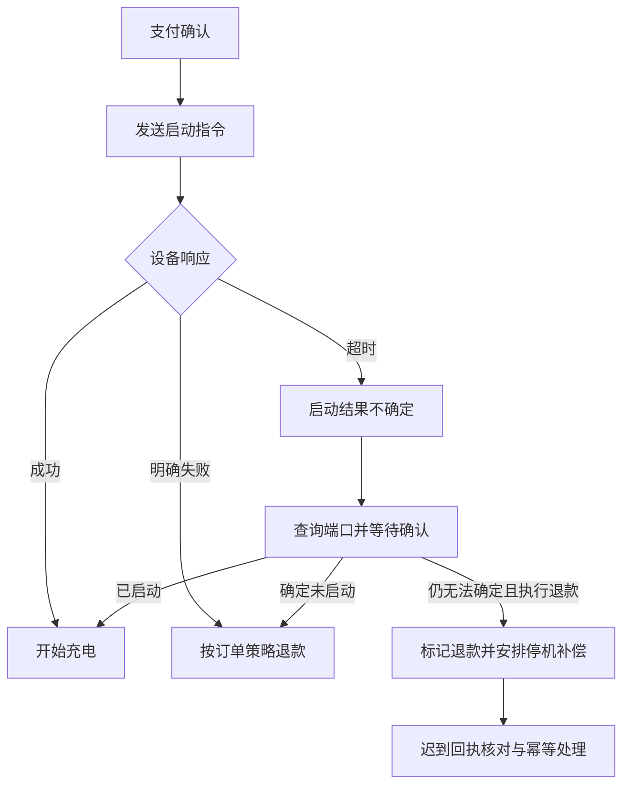

# 乐摇摇体验与 ChargePilot 改造方案

本报告面向 ChargePilot 产品与开发团队，依据 2026 年 9 月 30 日对乐摇摇测试账号的实际浏览器操作，以及当前工作区代码核对。核心建议是：以站点工作区完成收费配置，把计费规则、用户启动选项、固定售价套餐、退款策略与设备能力放在同一条操作流程中，但保留它们各自的数据与结算含义。

本文的改造建议保留体验阶段的讨论背景。后续已确认的多模式、统一方案模板、分钟计费和刷卡加时规则见[充电方案业务重构方案与计算示例](charging-scheme-redesign.md)；与本文建议不同的地方按后续方案审查，重构尚未实施。

本次没有修改 ChargePilot 业务代码。工作区原有的固定时长套餐修改仍保持原状。本报告描述的代码状态包含这些尚未提交的修改，不等同于线上已部署状态。

## 体验范围与完成边界

体验对象为模板管理、套餐设置、设备管理，包括二轮充电、汽车充电以及这些入口中出现的通用设置。按用户要求，脉冲不纳入改造范围。目标页面上的“串口”按用户确认的业务含义理解为 4G 连接；DC589 设备通过 4G 联网，使用 TCP 传输，DC589 是设备应用协议。目标平台具体某台设备采用哪种应用协议，不能由“串口”标签推断。

已执行模板创建、编辑、启用、禁用，充值优惠创建、编辑、删除，设备备注保存与恢复，以及端口禁用与恢复。已进入计费模式、服务费、时段、功率档位、套餐、退款、设备参数、远程操作和汽车桩编辑等分支。详细覆盖情况见[体验分支记录](leyaoyao-experience-coverage.md)。

**尚未满足“所有分支全部执行完成”这一要求。** 设备绑定入口在关闭首页提醒后仍持续显示加载中；没有未绑定的测试设备编码，不能完成真实新增、解绑后重新注册。远程启动页的测试设备端口选择器为空，不能验证指令执行。故障列表和部分任务记录为空，不能验证处理成功分支。保障购买只体验到规则与费用预览，没有提交购买。配置页面的保存成功与端口状态变化，也不能代替实际硬件、支付或结算验证。

这些缺口是本次实测限制，不是功能不存在的结论。后续补测应使用可恢复配置、可观察端口状态的专用测试设备，记录设备响应和订单结果。

## 业务概念必须分清

| 概念 | 本次观察到的含义 | ChargePilot 应如何表达 |
| --- | --- | --- |
| 计费规则 | 按电量、实时功率、最大功率等计算费用，可包含时段、电损和服务费 | 回答“充电过程中如何算钱”，显示完整单位和算例 |
| 按金额启动 | 选择金额，结合当前计费规则消费 | 显示预付金额、消费上限、停止条件及剩余金额处理 |
| 服务端计费中的时长选项 | 编辑器主要填写名称和分钟数，另有启动余额门槛 | 命名为“充电时长选项”；不能仅凭分钟数承诺固定支付金额 |
| 设备时长套餐 | 同时配置价格和分钟数 | 显示明确售价与时长，说明设备执行与退款依据 |
| 固定售价套餐 | 当前 ChargePilot 的 package 类型同时具有售价和时长 | 用户付款取套餐售价，提前结束按当前实现的未使用时长规则退款 |
| 目标平台的固定时长模式 | 帮助说明指向充满后继续供电、实时计费，并要求设备支持 | 表达供电和停止行为，不作为固定售价套餐类型 |
| 充值优惠 | 充值金额与赠送余额 | 属于账户充值业务，与单次充电套餐分开 |
| 次卡套餐 | 已购买次卡的用户看到的独立启动选项 | 与会员权益和适用范围关联，不能与现金套餐混为一谈 |
| 保障费用 | 按次或按场地购买的独立付费业务 | 独立展示收费主体、费用和开通状态，避免隐含在充电服务费中 |

目标平台复用了“套餐”“固定时长”等词，不能逐字搬入 ChargePilot 数据模型。尤其需要区分“选两小时，按费率扣费”和“支付五元，购买两小时”。前者尚需余额或支付规则确定可扣金额，后者的金额由套餐售价直接确定。

### 当前固定套餐实现

当前工作区中，套餐模板要求正数售价；固定时长套餐还要求有效分钟数。无售价的旧套餐保留在后台供修复，用户端不再售卖。站点上架生成在售记录，模板后续修改不直接改变已上架记录。

结算代码优先按购买的固定套餐快照处理：例如 5 元购买 120 分钟，使用 60 分钟时费用为 2.50 元；使用超过 120 分钟也不超过 5 元。当前实现把这笔固定套餐费用记为套餐服务费，没有单独电费拆分。该行为是 **ChargePilot 当前代码**，不是本次对乐摇摇真实订单结算的验证。

相关代码：[套餐模板校验](../internal/central/admin/package_templates.go)、[有效在售套餐](../internal/central/pricing/offer.go)、[结算](../internal/central/pricing/device.go)、[套餐结算测试](../internal/central/pricing/offer_actual_test.go)。后续若要改变退款比例、优惠、免费窗口或电费拆分，必须修改合同含义及结算实现，不能只改界面文案。

## 目标平台值得保留的交互

1. 在设备详情进入套餐配置，操作者能知道正在修改哪台设备；配置页提供设备范围明细。
2. 模板应用后可以进一步编辑，减少从零输入，但需要补足版本与差异说明。
3. 时段从 00:00 开始，只编辑结束时间，修改后自动补齐到 24:00，降低缺段风险。
4. 汽车桩的多组价格可供多个时段复用；参数模板能够填入设备及充电枪参数。
5. 扫码与在线卡的退款分开设置，并区分退款规则与退款去向。
6. 批量操作先选择范围，远程操作和参数设置有记录入口。

这些能力应结合设备协议的实际支持范围落地，不能因为页面上可以选择，就认为 DC589 已支持全部能力。

## 实测问题与对现有系统的影响

| 实测现象 | 对 ChargePilot 的改造建议 |
| --- | --- |
| 同一个服务端配置包含计费、电费倍率、时间选项、金额选项、次卡、电损、刷卡限制和展示开关，页面很长 | 改为按运营步骤组织的分区，常用设置先展示，相关高级选项随选择展开 |
| 固定时长模式的真实含义藏在说明中 | 用“充满后继续供电至所选时长”等经过设备能力核对的说明表达行为，独立于售价类型 |
| 按小时收费的模板，确认页时段明细标元/度且可以独立编辑 | 用户收费明细由实际规则生成，单位随计费口径变化；不允许第二份可编辑价格 |
| 价格类别1到4缺少业务名称，汽车服务费字段只标元 | 价格组可命名，完整标注元/度、元/小时或元/次 |
| 成本工具中成本0.8加20%得到0.96，字段却使用毛利率表述 | 若算法为成本加成则命名“加价比例”；若为销售毛利率则使用成本÷一减毛利率，分别给算例 |
| 新建时长套餐填最低消费0，被提示不能小于0；改0.1后通过 | 合法范围和提示一致，明确0是否表示不设最低消费；前后端使用同一规则 |
| 功率档位最多5档；结束时间以半小时步长选择 | 这些是目标页面限制，不能直接变成 DC589 的限制；由能力清单约束并在编辑前提示 |
| 设备列表60台，分析统计58台；同一场地不同入口显示不同数量 | 统一统计对象，明确网关、子插座、停用和非充电设备是否计入 |
| 活跃时间入口打开异常设备页，主要显示状态和故障时间 | 活跃时间、在线时间、故障时间分别命名，并支持设备下钻 |
| 汽车桩已有数据中电压下限221V高于上限220V | 编辑与导入增加跨字段校验，遗留异常显示待修复 |
| 参数模板选择直接覆盖品牌、型号、额定参数 | 应用前展示差异，尤其提示端口数量变化；已有设备不要静默覆盖 |
| 单台4G设备本地参数页为空，远程启动端口选择器为空 | 不可操作时显示原因和修复入口；把空数据与加载失败区分 |
| 首页设备绑定在关闭提醒后仍持续加载 | 浏览器场景提供手动输入编码作为明确入口，扫描能力不可用时给替代路径 |
| 超时退款说明针对无法确认启动结果 | 把启动不确定状态纳入订单状态机，处理迟到成功回执与退款后的停机补偿 |
| 保障购买穿插在套餐配置中 | 将独立付费业务放入清晰的开通区，费用预览与充电单价预览分开 |

以上只说明此次账号与界面中观察到的现象，不推断目标平台后台算法或全部设备实际行为。

## 站点工作区的操作方案

现有 ChargePilot 已把计费与套餐、设备、策略与下发记录放入站点工作区，并把计费模板和套餐模板收进模板中心的不同 tab。应继续完善这套结构，避免重新增加独立站点计费菜单。

进入站点后，先看到“当前收费方案”摘要：生效规则、在售套餐、用户可选启动方式、设备覆盖范围，以及平台版本与设备确认状态。操作者在同一页面完成以下步骤。

### 当前收费方案

摘要卡应区分“按规则计费”与“固定售价套餐”。金额方案展示预付消费上限和适用规则；固定套餐展示售价、时长、提前停止退款与是否自动停止。对每台设备标明“继承站点”“设备独立配置”及实际生效版本。

设备例外配置通过设备行的“调整收费”进入，工作区顶部保留设备上下文。恢复站点配置前展示将删除的例外关系和恢复后的内容。不要增加一个只有“站点默认”可选的范围下拉框；设备选择应承担明确的切换上下文职责。

### 模板的应用与更新

模板中心继续保留“计费规则”“套餐”两个 tab。前者包含计价公式，后者包含可售商品或金额启动选项。可以增加“收费方案组合”作为选配能力，用来引用规则、套餐与策略；它不应把各类字段强行塞进一张模板记录。

模板编辑只更新模板，发布才更新指定范围。已发布模板显示来源版本和当前模板版本，可查看差异后选择升级。对设备例外配置默认保留，操作者要覆盖时必须主动选择具体设备并看到差异。

批量发布先展示兼容、不可兼容、离线及独立配置设备数量。按设备逐项记录结果，允许重试失败项。重复点击或网络重试沿用同一请求标识。当前工作区已有版本校验、幂等应用和下发任务登记，应复用，补齐执行与回执证据。

## 计费编辑器方案

### 一次完成电费与服务费

先选择收费依据，再选择服务费方式。在需要功率档位时，每个时段内只维护一份档位表，电费与按档服务费同一行编辑；电量或按次服务费显示在表上方。不要另建一套服务费档位，让操作者回头重录。

档位仅保留一个“添加档位”入口。添加时使用当前已输入的上限，继承可复用价格，并检查后续上限是否仍递增。删除中间档位后显示新的覆盖范围。所有区间由相邻上限推导，第一档从0开始；“200W归哪档”直接在范围文本和算例中确认。

时段以卡片表示起止时间，结束时间使用时刻输入，最后一段固定结束于24:00。拆分时段、复制费率、合并相邻时段具有独立操作含义；合并前说明保留哪份价格。跨午夜显示连续覆盖校验，不能把24:00存成第二天00:00后误判为空时段。

### 计价与单位保持一致

按度计费显示元/度；按最大功率和小时计费显示元/小时；按次服务费显示元/次。历史实时功率换算口径需要展示实际算式与迁移提醒，不能仅替换字段名称。

目标页面存在最高功率档外改按电量收费的规则；当前 ChargePilot 计价实现超过最高档时仍取最后一档。若需要新增“超档改按电量”，应新增明确的规则字段及设备兼容校验，同步预估、自动停止和结算，不可只增加一个提示。

预览至少包含低功率、高功率、跨时段、提前停止和达到上限五个场景。展示电费、服务费、总额及退款。规则说明默认从这份规则生成，可补充运营说明，但补充文字不能改写实际收费承诺。

## 套餐与支付方案

新建套餐先问用户买的是什么，使用两张选择卡：金额方案、固定时长套餐。金额方案填写消费上限，说明按当前规则实际扣费；固定套餐同时填写售价和时长，说明当前退款算法。

“充电时长选项”若被纳入产品，应作为按规则计费的启动选项独立建模，明确从余额消费还是发起预付、余额门槛、时间到达停止、余额不足停止，以及充满停止行为。不能创建 price_cents 为0的 package 来代替。

充值优惠和次卡权益仅在其对应业务中配置。站点可以引用它们，但套餐编辑页不直接混入充值金额和赠送余额。免费充电如确需支持，应增加显式免费权益与权限控制，不能利用缺少售价的旧套餐表达。

固定套餐预览必须给出付款金额。例如“5元购买120分钟”，并直接展示“使用60分钟预计收取2.50元，未使用部分按当前规则退还”。金额方案则展示“预付10元，按费率消费，上限10元”，不能暗示一定买到某个时长。

## 退款与启动策略方案

将退款拆成事件、计算方式和去向。启动失败、启动不确定、用户提前结束、设备故障结束属于不同事件。比例退款必须说明比例基数和时效起点，限时规则必须提供分钟数与超时处理，不使用一个没有参数的枚举代替完整业务规则。

目标平台可选择扫码与在线卡退款、实时与限时处理、金额或比例门槛；这些配置页面不证明真实退款已经执行。ChargePilot 当前站点策略的读写和界面已经存在，但本次代码搜索中未找到充电运行链路读取 station_policy 的证据；已有启动失败退款链路按自身逻辑生成退款。应作为接入缺口进一步核对，而不能标为策略已经影响订单。

建议用以下状态过程处理启动不确定，具体超时值依据设备协议和测试结果确定。

免费窗口、最低电费、套餐退款与充值赠送部分的退回，需要明确优先顺序。当前固定套餐结算先于按规则计费，不能假定规则中的免费窗口会自动作用到固定套餐。

## 设备管理方案

列表显示设备名称、编号、站点、在线状态、最后通讯、可用与占用端口、收费来源、下发状态和故障。连接方式4G、传输TCP、应用协议DC589分别表达；厂商、型号和固件版本用于确定能力，不能用厂商名称替代协议。

设备详情按概况、端口、收费、运维记录组织。网关与子插座用拓扑表达，计数注明主设备还是子设备。汽车充电枪的额定参数属于设备能力资料，收费参数来自收费方案，避免设备元数据编辑混入价格变更。

新建、导入共用当前已有开通流程，要求编码、厂商、站点、端口与计费能力。设备记录创建完成与物理设备已连接分别显示。编码可手动输入或扫描，不依赖某个客户端的扫描能力。

远程启动、停止、复位和参数修改应先检查在线、端口状态与当前订单。每项操作记录操作者、目标、原值、请求值、设备确认值、时间和结果。端口禁用需要明确只是平台禁用还是向设备下发。解绑与转移先展示网关子设备关系和未结束订单，再安排可追踪的流程。

设备能力清单至少包括端口上限、可用计费模式、是否上报电量、是否上报分段功率、档位与时段容量、固定供电行为、参数查询与回执能力。管理员只能选择实际支持的组合，不可用选项显示原因。

## 对当前实现的改造顺序

| 优先级 | 改造项 | 当前依据与验收重点 |
| --- | --- | --- |
| P0 | 明确套餐支付和退款合同 | 已有固定售价与时长校验，继续核对支付报价、订单快照、提前结束和设备上报一致性 |
| P0 | 接通站点策略与真实订单流程 | 已有策略保存，但运行链路的消费证据不足；验证扫码与刷卡、失败与超时各自执行结果 |
| P0 | 补齐计费下发任务执行闭环 | 已有计划和结果写入函数，本次搜索未找到 recordSwitchResult 调用；必须验证发送、ACK、超时与任务归并 |
| P0 | 单一计费规则和单位 | 预览、用户明细与结算同源，核对超档策略、跨时段、免费窗口和电损 |
| P1 | 站点收费方案摘要及发布差异 | 复用现有工作区，展示继承与独立配置、来源版本、实际确认版本 |
| P1 | 合并功率表与服务费编辑 | 使用一份档位数据，输入200W后添加保持原值，边界和删除可预测 |
| P1 | 套餐选择卡及用户端预览 | 明确金额方案、固定套餐、按规则的时间选项，不再靠长下拉文案解释 |
| P1 | 设备能力和运维状态 | 新建与导入共用能力校验，空参数页和空端口选择器显示具体原因 |
| P2 | 参数模板与批量运营 | 支持差异确认、失败项重试、模板版本升级和可恢复操作 |
| P2 | 账户充值和次卡整合 | 有业务需求时引入独立权益模型，引用到站点，不与现金套餐混合 |

P0 两项链路缺口来自当前生产代码搜索与相关实现阅读，仍应结合实际运行服务和数据库映射复核。不要根据页面、HTTP成功或孤立单测把它们认定为闭环。

相关入口：[站点工作区](../admin-web/src/pages/stations/StationWorkspace.tsx)、[站点收费配置](../admin-web/src/pages/stations/StationConfiguration.tsx)、[站点策略与任务记录](../admin-web/src/pages/stations/StationOperations.tsx)、[计费模板](../admin-web/src/pages/PricingTemplates.tsx)、[设备新建](../admin-web/src/pages/DeviceCreate.tsx)、[策略接口](../internal/central/admin/device_pricing.go)、[下发任务](../internal/central/admin/switch_tasks.go)、[启动结果](../internal/central/charge/start_result.go)。

## 数据与接口边界

继续使用现有计费模板、套餐模板、站点规则和在售套餐实体。新增组合方案时引用它们的版本，不复制出另一套未关联价格。平台期望配置、设备确认配置和订单购买快照分别保存；更新模板或设备配置不能改变历史订单的结算依据。

退款策略需要可验证的参数结构，包括适用支付渠道、事件、时效、比例或金额门槛、退款去向和版本。下发任务需要明确指令关联、目标版本、重试次数、超时、逐设备结果及汇总。设备能力由实际协议实现提供，前端展示与后端校验共用能力定义。

迁移旧套餐时保留原始记录与历史快照，标记缺少售价、单位不明或非法边界的配置，要求修复后再上架。迁移不能按猜测补售价，也不能把所有时长选项自动转为固定售价套餐。

## 验收场景

- 金额与固定套餐：付款金额明确，0和负数拒绝，旧无售价套餐不可售，模板修改不改旧订单，撤下后重新上架内容一致。
- 时间与功率：00:00至24:00覆盖连续，200W边界确定，新增不丢当前输入，删除和合并后合法，跨午夜与超档策略一致。
- 费用：电费、服务费、倍率、电损、最低消费和免费窗口顺序一致，预估与结算使用同一规则，按秒比例计算正确且不超套餐售价。
- 范围：站点继承、设备独立配置、恢复继承和同模板套餐覆盖符合展示；切换上下文不会保存到旧设备。
- 发布：混合设备兼容性、离线设备、部分失败、重复请求、ACK迟到、任务超时和失败项重试可观察且幂等。
- 设备：新建、导入、重复编码、非法端口数、参数上限小于下限、转移中订单、解绑与重新注册具有明确结果。
- 退款：明确启动失败、启动不确定、支付回调重复、退款回调重复、退款后迟到成功、主动结束与设备故障分别验证。
- 权限：管理员能看到授权厂商菜单，厂商范围不能修改其他设备或站点；读权限不能执行远程指令和发布。

## 测试数据与恢复

| 操作对象 | 本次实际操作 | 最终状态 |
| --- | --- | --- |
| CP体验0930 | 新建、禁用、启用、编辑备注、再次禁用 | 保留禁用模板，备注为测试账号交互体验，编辑验证；本次未执行设备绑定 |
| CP汽0930 | 新建汽车模板，两段价格1.2与0.6，随后禁用 | 保留禁用模板，本次未应用到设备 |
| 广州大学城11充值优惠 | 创建7.77元送0元，编辑7.78元送0元，经用户确认删除 | 恢复原六档配置 |
| 网关设备备注 | 保存测试备注，再恢复空备注 | 已恢复 |
| 子插座端口1 | 禁用，再启用 | 页面显示已启用且空闲，硬件执行回执未验证 |
| 单台及批量收费配置 | 切换模式、模板、价格与展示选项，查看草稿 | 未提交已有设备的收费修改 |
| 汽车设备元数据 | 选择参数模板、新增及移除未保存充电枪、检查空品牌校验 | 未保存已有设备参数修改 |
| 保障购买 | 查看规则、设备选择和金额预览 | 未提交购买 |

浏览器快照和截图暂存在 `/private/tmp/chargepilot-leyaoyao-audit`，可能被系统清理。原始材料包含账号与场地信息，不适合直接公开。项目内仅保留选取的模板及恢复证据，见[体验分支记录](leyaoyao-experience-coverage.md)。
